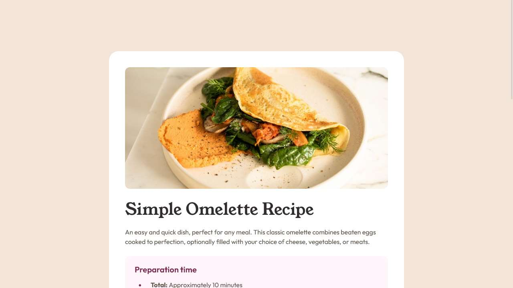
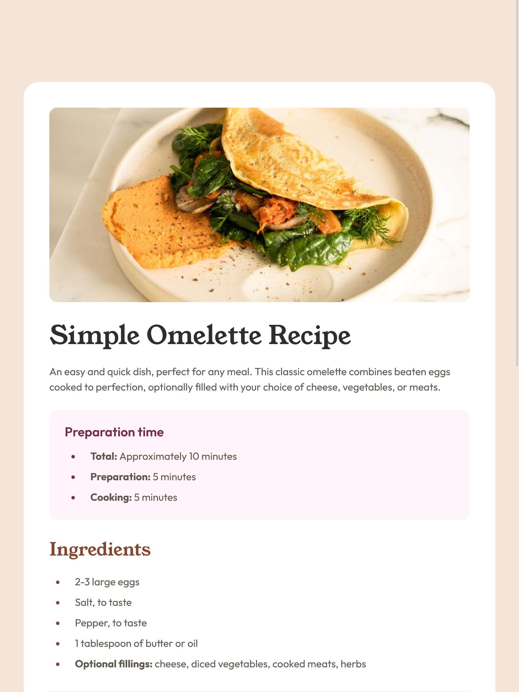
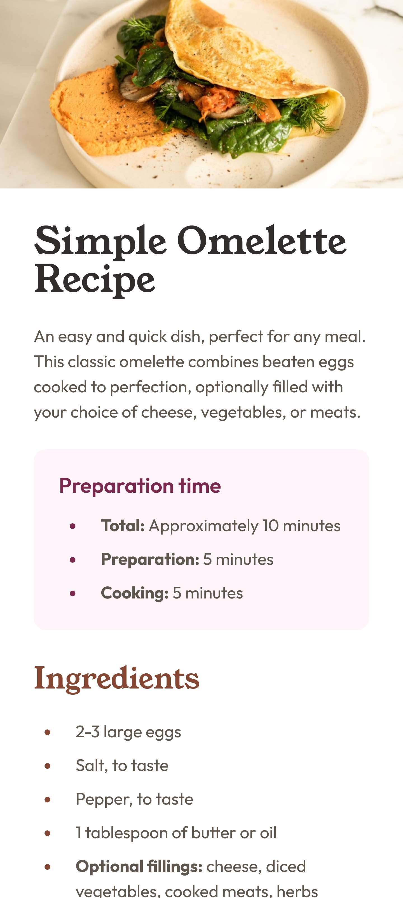

# Frontend Mentor - Recipe page solution

This is a solution to the [Recipe page challenge on Frontend Mentor](https://www.frontendmentor.io/challenges/recipe-page-KiTsR8QQKm). Frontend Mentor challenges help you improve your coding skills by building realistic projects. 

## Table of contents

- [Overview](#overview)
  - [Screenshot](#screenshot)
  - [Links](#links)
- [My process](#my-process)
  - [Built with](#built-with)
  - [What I learned](#what-i-learned)
  - [My favourite code](#my-favourite-code)
  - [Useful resources](#useful-resources)
- [Author](#author)


## Overview

### Screenshot


<div style="display: flex; justify-content: center; gap: 1rem;">
  
  
</div>


### Links

- Solution URL: [Recipe Page Solution](https://github.com/kapil-2695/fmc-recipe-page)
- Live Site URL: [Live site - Recipe Page](https://kapil-2695.github.io/fmc-recipe-page)


## My process
  
### Built with

- Semantic HTML5 markup
- CSS custom properties
- CSS logical properties
- CSS Grid, Flexbox
- CSS `calc()` function
- CSS pseudo-class selectors


### What I learned

- I learned to design the layout - mobile first.
- I learned to make use of text-presets for different types of text formating in the document.
- I used the CSS logical properties such as margin-inline, margin-block etc.
- I made use of HTML sementic element table and learned to design it with CSS.
- I made extensive use of pseudo-class and functional pseudo-class selectors while designing the table.


### My favourite code

```css
.nutrition__table {
    table-layout: fixed;
    border-collapse: collapse;
    width: 100%;
    margin-block-start: calc(0.5 * var(--spacing-150));
}
.nutrition__table td {
    padding-block: calc(0.5 * var(--spacing-150));
}
.nutrition__table td:last-child {
    color: var(--clr-brown)
}
.nutrition__table td:first-child {
    padding-inline-start: var(--spacing-200);
    width: 50%;
}
.nutrition__table tr:not(:last-child) td {
    border-block-end: 1px solid var(--clr-stone-150);
}
```


### Useful resources

- [Learn CSS - web.dev](https://web.dev/learn/css/) - This helped me with CSS code.


## Author

- Frontend Mentor - [@kapil-2695](https://www.frontendmentor.io/profile/kapil-2695)
